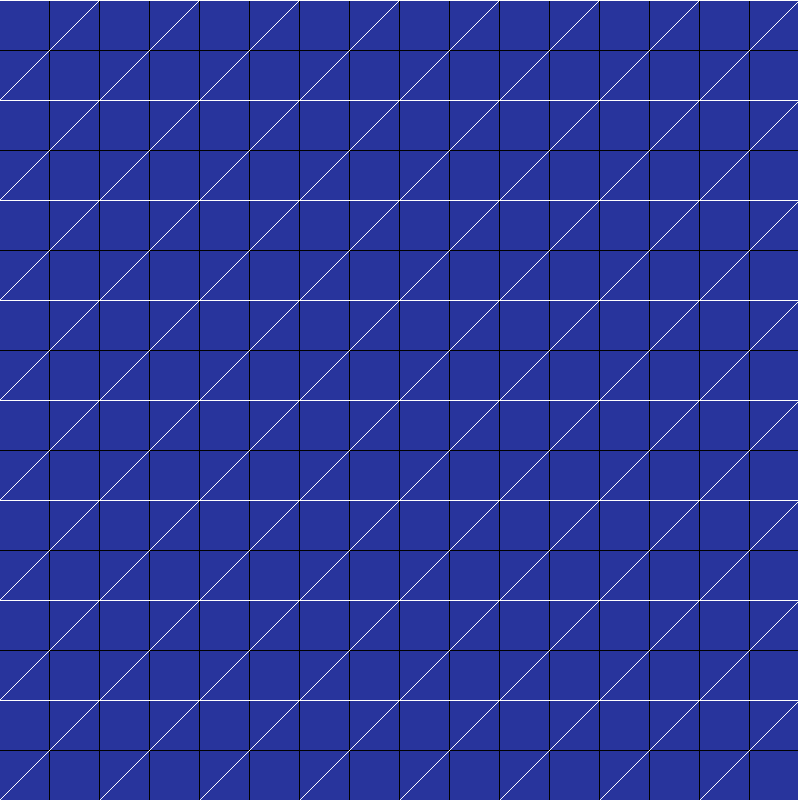
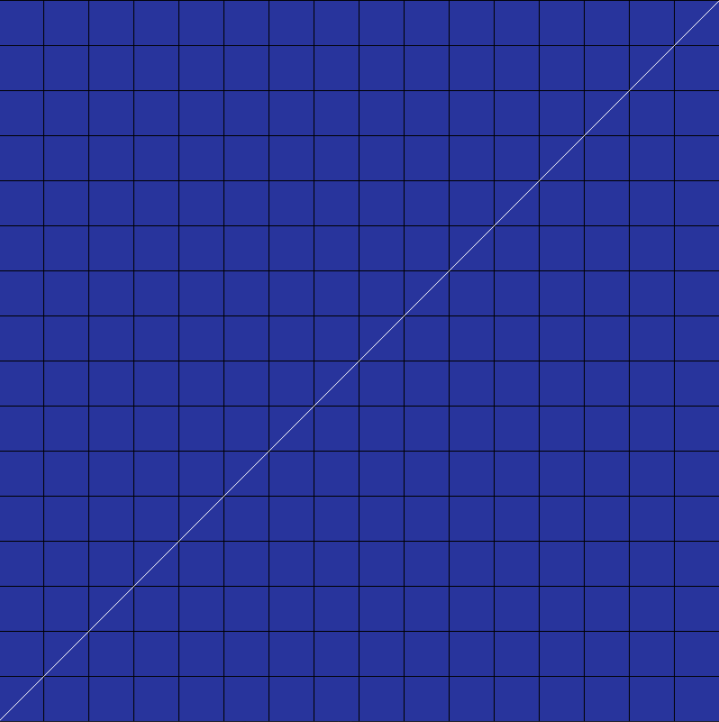

# LinearTransformation

## The goal of this article is to show you how useful matrices can be in transforming 2D space making really cool visual animations inspired by a youtube series <a href="https://youtube.com/playlist?list=PLZHQObOWTQDPD3MizzM2xVFitgF8hE_ab">Essense of Linear Algebra" by 3Blue1Brown</a> (Go check out his channel if you haven't already). I highly recommend you to read this document before moving on with the actual software

 

Matrices are a lot more than boxes containing a few numbers (or any kind of data ). If we treat them like simple functions they can we really useful for transforming space (2D or 3D).
In theory a function is like a machine, we give it an input and it spits out an output.
 

Lets think of a function that takes in a vector as input and spits out a new vector

 

 

<b>v1</b> being our input vector adn <b>v2</b> being our output vector.

Now lets define this function f(<b>v</b>) such that  it can take any real 2D vector and give us some other real vector in return.

Now imagine what happens if we take some 2D space and apply this function to every vector in that space?
What would the resultant space look like?

Lets just take a grid in 2D space.

  
  

Now we apply this function to every point on this grid. What do we get? Well that depends on what our function was. Our results may vary from this ...

  

 

to this ...

 
(this is all of 2D space squished into a single line)

This function which takes in a vector and modifies it into a new vector is called a transformation function. After we transformed out grid, if the origin stays in place and the grid lines are parallel to each other then its known as a "linear transformation". Now how do we define a linear transformation function?

It is best done with matrices. Computer engineers and designers use matrices in animations/simulations all the time to define a change in space such as scaling or rotation or anything much more complicated. So how to define such a matrix you amy ask. 

In theory we can reoresent any vector as a combination of its basis vectors. For example :- <b>v</b> = 4<b>i</b> + 3<b>j</b>.
By convention the unit vector i is taken to be 1 unit along the X axis and vector j is taken to be 1 unit length along the Y axis.

 

This vector <b>v</b> is represented by scaling the i vector 4 times and the <b>j</b> vector 3 times.

So every vector in our 2D plane is made of 2 basis vectors. If we transform these 2 basis vectors using our transformation function/matrix and then represent every other vector in our grid by scaling them along the new basis vectors, we will end up with a completely different grid. Our transformation matrix will contain information about the new coordinates where our basis vectors will land after the transformation takes place. Suppose after transformation our <b>i</b> vector goes from (1,0) to (2,2) and out <b>j</b> vector goes from (0,1) to (-2,2) then our transformation matrix will look like:- 

 

Now we take any vector from our original grid (such as <b>v</b> = 4<b>i</b> + 3<b>j</b>) in a matrix form represnted like :- 

We mulitply these 2 matrices to get a resultant vector.

 

So 4i + 3j becomes 2<b>i</b> + 14<b>j</b> after transformation, where <b>i</b> and <b>j</b> are our original basis vectors

So just by specifying where our 2 basis vectors should land we can make a nice working transformation matrix. The general rule of thumb in making such a matrix is :-

Where ix and iy are the x and y coordinates of the point where our basis vector <b>i</b> lands after transformation and the same goes for <b>j</b>.

Now take any input vector <b>v1</b> = v1x<b>i</b> + v1y<b>j</b> in a 2x1 matrix like :-

Now to get the resultant vector <b>v2</b> =  v2x<b>i</b> + v2y<b>j</b> we do the matrix multiplication of TransMatrix X InputVector.

## `How to run the software`

Now lets come to the fun part where you can try out the matrices yoruself. First make sure you have g++ installed, its a c++ compiler. If you dont have it then  for windows install the mingw package <a href = "https://sourceforge.net/projects/mingw/"> here</a> and make sure to add it to your path variable. If you are on linux then use your appropiate package manager to install g++. If you are on iOS then you can use clang. Now after cloning the repo double click on the respective run file. A terminal should open up asking you for your screen resolution or press enter for the default. Then you will be prompted to enter the values of a 2x2 matrix in the order of ix, iy, jx and jy. Press enter to see the window pop up where the black lines are the old grid and the white ones are new transformed grid. Pretty simple right?

It was one of my first serious projects i prepared specifically for the maths summer of expidition challenge. Although it isnt perfect it took me a lot of time to make this as a beginner. I hope you liked it. Any kind of contribution is appreciated. 