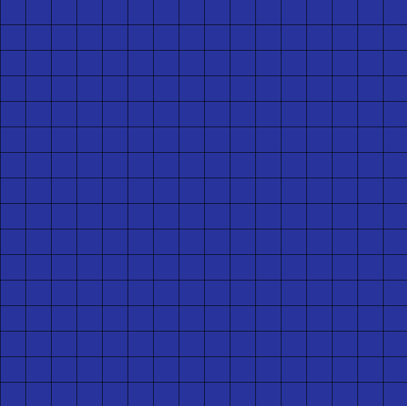

# LinearTransformation

## The goal of this article is to show you how useful matrices can be in transforming 2D space making relaly cool visual animations. I highly recommend you to read this document before moving on with the actual software

 

Matrices are a lot more than boxes containing a few numbers (or any kind of data ). If we treat them like simple functions they can we really useful for transforming space (2D or 3D).
In theory a function is like a machine, we give it an input and it spits out an output.
 

Lets think of a function that takes in a vector as input and spits out a new vector

 

 

<b>v1</b> being our input vector adn <b>v2</b> being our output vector.

Now lets define this function f(<b>v</b>) such that  it can take any real 2D vector and give us some other real vector in return.

Now imagine what happens if we take some 2D space and apply this function to every vector in that space?
What would the resultant space look like?

Lets just take a grid in 2D space.

  
  

Now we apply this function to every point on this grid. What do we get? Well that depends on what our function was. Our results may vary from this ...

  

 

to this ...

 
(this is all of 2D space squished into a single line)

This function which takes in a vector and modifies it into a new vector is called a transformation function. After we transformed out grid, if the origin stays in place and the grid lines are parallel to each other then its known as a "linear transformation". Now how do we define a linear transformation function?

It is best done with matrices. Computer engineers and designers use matrices in animations/simulations all the time to define a change in space such as scaling or rotation or anything much more complicated. So how to define such a matrix you amy ask. 

In theory we can reoresent any vector as a combination of its basis vectors. For example :- <b>v</b> = 4<b>i</b> + 3<b>j</b>.
By convention the unit vector i is taken to be 1 unit along the X axis and vector j is taken to be 1 unit length along the Y axis.

 

This vector <b>v</b> is represented by scaling the i vector 4 times and the <b>j</b> vector 3 times.

So every vector in our 2D plane is made of 2 basis vectors. If we transform these 2 basis vectors using our transformation function/matrix and then represent every other vector in our grid by scaling them along the new basis vectors, we will end up with a completely different grid. Our transformation matrix will contain information about the new coordinates where our basis vectors will land after the transformation takes place. Suppose after transformation our <b>i</b> vector goes from (1,0) to (2,2) and out <b>j</b> vector goes from (0,1) to (-2,2) then our transformation matrix will look like:- 

 

Now we take any vector from our original grid (such as <b>v</b> = 4<b>i</b> + 3<b>j</b>) in a matrix form represnted like :- 

We mulitply these 2 matrices to get a resultant vector.

 

So 4i + 3j becomes 2i + 14j after transformation.

